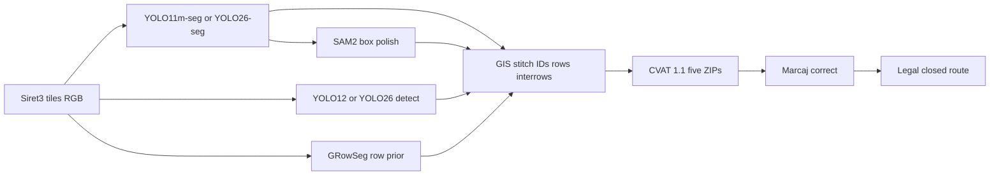

# SOTA models — weekend lock (25 Sep 2026)

Decision record for **what we train this weekend**. Searched 25 Sep 2026. Only papers that change a scored slice stay in the lock table. The long catalogue is [`vineyard-research.md`](vineyard-research.md). Verbal briefing vs PDF: [`provider-briefing.md`](provider-briefing.md). Scores: [`scoring.md`](scoring.md).

Official PDFs win if a paper and Marcaj rules disagree.

---

## Locked weekend stack

| Slice | Score | Model / method | Why |
| --- | --- | --- | --- |
| Canopy | 25% | YOLO11m-seg on Riseholme COCO; optional YOLO26-seg or RF-DETR-Seg A/B | Native `vineyard` instances; small-object options if H100 is free |
| Waste | 10% | YOLO12 or YOLO26 detect on DroneWaste, **1 class**, high precision | Latest public aerial-waste numbers |
| Row prior | feeds 8% axes | GRowSeg zero-shot (SegFormer-B5, MIT) | Nadir row mask, no train |
| Polish | canopy F1 | SAM2 **box** prompts on hard / touching canopies | SAM3 **text** is weak on overhead RS |
| Rows / IDs / inter-rows / cover / gaps | 15% + 10% + route targets | GIS: `ids.py`, LCAS helpers, 5 m gap rule, ExG | Matches Marcaj geometry rules |
| Route | 25% on inspector file | Two walks: inspector (gaps + waste) + farmer (waste only). Same legal graph | Coverage first (2 m) on `route.geojson`, then shorten |

**Default train:** YOLO11m-seg (Riseholme used YOLOv11). Infer 2048×2048 tiles at imgsz 1280. Split fused canopies at 1.0–1.5 m along the row. Empty-tile gate: if GRowSeg finds no row, emit **zero** canopies (false-canopy penalty).

**Do not** train RowDetr, SAM3-as-detector, AGRIDS, Kaggle Riseholme, or ground bunch/cordon models this weekend.

---

## Canopies — 25%

Scored as `0.6 × class IoU + 0.4 × F1` of individual canopies at IoU ≥ 0.5. Empty-tile false canopies cost `0.5 ×` the share of the tile they cover. One polygon per plant.

### Use

| Work | Date | What it is | Licence / link | How we use it |
| --- | --- | --- | --- | --- |
| Riseholme UAV COCO | 2026-03-26 | 855 images, 40,215 instances: `pole`, `trunk`, `vine_row`, `vineyard` | CC-BY-4.0 — [10.5281/zenodo.19234907](https://doi.org/10.5281/zenodo.19234907) | **Primary pretrain.** Map `vineyard` → canopy. `vine_row` is a mask; skeletonise to a polyline. |
| Cox et al., *An Integrated Aerial-Ground System for Vineyard Mapping* | 2026 (SSRN) | Paper behind Riseholme / VISTA | [10.2139/ssrn.6643045](https://doi.org/10.2139/ssrn.6643045) | Cite. Confirms YOLOv11 instance seg on this set. |
| LCAS `uav-vineyard-mapping` | 2026-03-26 | `poles_to_rows.py`, `mid_row_lines.py`, optional `scripts/roboflow_rfdetr/` | Apache-2.0 — [github.com/LCAS/uav-vineyard-mapping](https://github.com/LCAS/uav-vineyard-mapping) | GIS after the instance head. **No** YOLO weights in the repo. |
| YOLO26-seg | Sep/Oct 2025 | NMS-free, STAL small-target assignment, MuSGD | AGPL-3.0 — analysis [arXiv:2509.25164](https://arxiv.org/pdf/2509.25164) | **A/B** if H100 is free. Better for young ~0.2–1 m vines. Riseholme card is YOLO11, so YOLO11m-seg is the safer first train. |
| RF-DETR-Seg | preview Oct 2025; Nano–2XL Jan 2026 | DINOv2 DETR + MaskDINO-style head. Roboflow: RF-DETR-M **+5 to +7.6 mAP** vs YOLO11-M on aerial RF100-VL | Apache-2.0 (open family). Plus XL/2XL is **PML 1.0 — skip** — [github.com/roboflow/rf-detr](https://github.com/roboflow/rf-detr), [aerial blog](https://blog.roboflow.com/ai-for-aerial-imagery/) | Second architecture if YOLO merges touching canopies. LCAS already has an optional RF-DETR script. |
| Remote SAMsing | 2026-05 | Tile + multi-pass SAM2 + merge across tile edges | [arXiv:2605.00256](https://arxiv.org/html/2605.00256v1) | Polish recipe on 2048 tiles, not a detector. |
| SAM3 RS papers | Dec 2025 – Jul 2026 | SegEarth-OV3; Promptable Concept Segmentation from Above | [arXiv:2512.08730](https://arxiv.org/html/2512.08730), [arXiv:2607.09583](https://arxiv.gg/abs/2607.09583) | **Text prompts fail** on overhead RS. Box / point prompts work. Do not zero-shot “grapevine” as the primary head. |
| SAM for tree crowns | 2025-03 | Vanilla SAM loses to a custom Mask R-CNN on young plantations | [arXiv:2503.20199](https://arxiv.org/html/2503.20199v1) | Do not auto-SAM empty tiles. |
| SAM3 vineyard empty-area repo | 2026 (undated card) | Prompt recipe for rows + empty stretches | [github.com/abdulkadiryildirim/Vineyard-Row-Detection-and-Empty-Area-Analysis-with-SAM3-Model](https://github.com/abdulkadiryildirim/Vineyard-Row-Detection-and-Empty-Area-Analysis-with-SAM3-Model) | Read prompts. Not a Sireț3 checkpoint. |

**Lock:** train YOLO11m-seg on Riseholme (`vineyard` + optional `vine_row`). Infer at imgsz 1280. Split fused canopies at the in-row spacing (1.0–1.5 m). SAM2 box-prompt only on low-confidence or touching plants. If the row prior is empty, emit no canopies.

### Skip (wrong viewpoint or wrong object)

| Work | Why skip |
| --- | --- |
| Grapevine-Seg / improved YOLACT, OENO One 2026 — [10.20870/oeno-one.2026.60.1.9628](https://doi.org/10.20870/oeno-one.2026.60.1.9628), data [10.5281/zenodo.18218165](https://doi.org/10.5281/zenodo.18218165) | Ground cordons / shoots, not nadir canopies |
| VinePT-Map, Mar 2026 — [arXiv:2603.05070](https://arxiv.org/html/2603.05070) | Rover RGB-D poles and trunks |
| YOLOv11-IMP — [Agronomy 16(3):370](https://www.mdpi.com/2073-4395/16/3/370) | Grape **clusters** / yield |
| YOLOv8-SAM grape clusters (HSW 2025) — [10.1109/hswtech64936.2025.11278142](https://doi.org/10.1109/hswtech64936.2025.11278142) | Ground bunches |
| YOLOSc-SAM farmland extraction | Field **blocks**, not plants |
| CountMamba plant counting — [arXiv:2410.07528](https://arxiv.org/html/2410.07528v1) | Density counting, not instance polygons |

---

## Waste — 10%

Bounding-box F1, one-to-one, IoU ≥ 0.3. Miss = FP = duplicate. Official rule: when in doubt, leave it out.

| Work | Date | Result | How we use it |
| --- | --- | --- | --- |
| DroneWaste dataset | 2025–2026 | 4,993 images, 5,135 instances, 20 EWC materials | CC-BY-4.0 — [10.5281/zenodo.17045559](https://doi.org/10.5281/zenodo.17045559) |
| Morandini et al., Scientific Data | 2026 | Paper for the set | Cite; article is CC BY-NC-ND — [10.1038/s41597-026-07970-1](https://doi.org/10.1038/s41597-026-07970-1) |
| `lucamora/dronewaste` | 2026 | YOLOv12x **38.5%** mAP@50; YOLOv8x 38.2%; Faster R-CNN 36.5% | MIT — [github.com/lucamora/dronewaste](https://github.com/lucamora/dronewaste) |

Domain gap: DroneWaste orthos are coarser than our 2.5 cm tiles. Collapse 20 classes to one `waste` box. High confidence. Drop vine tubes, stakes, trellis, irrigation, stones, pale soil, pruning piles, vehicles (annotation rules).

**Lock:** YOLO12 or YOLO26 detect on DroneWaste, single class. No TACO (ground litter).

---

## Rows, gaps, IDs — 8% axes + inspection targets

A predicted axis matches when **each** line lies ≥ 80% within **0.4 m** of the other. Gaps do not split `row_id`. `row_structure` = `disrupted` if a gap ≥ **5 m** in this tile.

| Work | Date | What transfers | What does not |
| --- | --- | --- | --- |
| GRowSeg (SegFormer-B5) | VitiGEOSS / HF card current | Zero-shot nadir row mask. Optimal GSD ~1–1.5 cm/px → `scaling_factor ≈ 2.5 / 1.5` | Semantic rows, not instance canopies. MIT — [huggingface.co/links-ads/gaia-growseg](https://huggingface.co/links-ads/gaia-growseg) |
| LCAS `poles_to_rows` / `mid_row_lines` | 2026-03 | GIS after poles / canopies | No trainer |
| RowDetr | journal 2025-10; arXiv 2412.10525v3 | Idea: **one polyline through gaps** | Under-canopy robot camera. Do **not** train — [arXiv:2412.10525](https://arxiv.org/html/2412.10525v3) |
| Di Gennaro et al., missing plants | 2023 | Spacing along the axis; ~93% in **dormant** 3D | Sireț3 is **leaf-on May**. No winter point cloud — [10.3390/drones7060349](https://doi.org/10.3390/drones7060349) |
| Primicerio et al. | 2017 | Individual plant + missing-plant characterisation from high-res UAV | Method ancestor |
| Drones Imaging, Saint-Émilion | 2026-03 | Detect stocks, then interpolate regular spacing (44,423 vines, 568 missing, ~10 cm) | Commercial write-up, not a public model — [dronesimaging.com](https://www.dronesimaging.com/en/geospatial-localization-of-vine-stocks/) |
| Vineyard gap CNN (multispectral YOLO) | 2022 | Gaps as objects | We have RGB only; 5 m rule is GIS |

**Lock:** row polyline = skeleton / least-squares of canopy centroids + GRowSeg mask, straight through gaps, same `row_id` across tiles. Inspect waypoints = gap midpoints (≥ 5 m) with `vineyard_id` / `row_id`. These go in **application output**, not Marcaj.

---

## Inter-row cover — part of 5% attributes

Official bins (this tile, this polygon): vegetation &lt;¼ → `bare_soil`; ¼–¾ → `mixed`; &gt;¾ → `vegetation`; unseen → `unassessable`.

| Work | Note |
| --- | --- |
| *Vineyard Groundcover Biodiversity* (Horticulturae) — UNet-EfficientNetB0, 9 classes (canopy, bare soil, 7 cover-crop communities), 85.4% acc / 59.8% mIoU — [mdpi.com/2624-7402/7/12/434](https://www.mdpi.com/2624-7402/7/12/434) | One farm, too many classes. Do not train unless ExG fails on the two example tiles. |

**Lock:** excess-green (ExG) fraction inside each `interrow_area`. No extra UNet by default.

---

## Route — 25%

Nothing published in 2026 beats a **legal graph + TSP** for this brief.

- Passable = `interrow_area` ∪ `passages.geojson` − `forbidden.geojson` − canopies.
- Visit waste centroids and gap midpoints within **2 m**.
- Closed at official start ± **5 m**.
- Instant **0** if &gt;2% of length is illegal.
- Efficiency (`L_ref / L`) only after ~90% coverage.

Briefing hint ([`provider-briefing.md`](provider-briefing.md)): gaps reachable from **both** adjacent inter-rows; waste from the passable side only. Use that in the waypoint graph. Do not invent a “middle tree of every row” target list.

ICAERUS inter-row path helper is a reference, not the scored solver. OR-Tools if waypoint count blows up.

---

## What we will not build (even if someone calls it SOTA)

- SAM3 open-vocabulary as the **primary** canopy detector (text bias, empty-tile false positives).
- AGRIDS YOLO zip or the Kaggle Riseholme mirror (**NC / ND**).
- Ground bunch, cordon, disease, or rover pole/trunk models.
- Multispectral / DSM / LiDAR papers (Sireț3 tiles are RGB; scoring is planar, no DEM).
- Live drone updates, ground robots, real-time streaming (coach: nail the core).
- Paid APIs unless listed in the README. Default: local H100 + open weights.

---

## Hardware profiles (unchanged)

| Profile | Canopy | Waste | Polish |
| --- | --- | --- | --- |
| H100 (default) | `yolo11m-seg` or `yolo26m-seg`, imgsz 1280 | `yolo12` / `yolo26` detect, imgsz 1280 | SAM2 on uncertain tiles |
| 16 GB | `yolo11s-seg`, imgsz 1024, batch 4 | `yolo11s` detect | MobileSAM or skip |
| CPU emergency | GRowSeg + classical colour | skip YOLO waste | none |

Weights stay under `models/weights/` (gitignored).

---

## Verification

Searched 25 Sep 2026: arXiv, MDPI, Zenodo, Hugging Face, Roboflow blog, LCAS, DroneWaste GitHub. Older methods (GRowSeg, OrthoSeg, Primicerio, Di Gennaro) stay because they still transfer. Ground-level 2026 papers are recorded so we do not rediscover them.

If a new official Slack pin changes a label or score, update [`scoring.md`](scoring.md) first, then this lock table.
